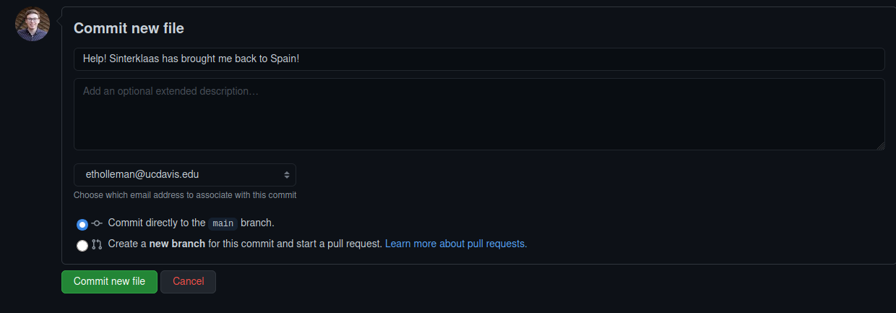

# resources-misc

Repository for notes, links and other useful information.

# Interacting with repositories through github.com

The easiest way to upload or create files is just to use GitHub's web
interface.

## Creating or uploading new files

First select `Add file` at the top of the repository page. You can either
add a file that is stored locally on your computer or create a text file
from the browser.

If you want to GitHub to render your file's content (like this `README.md` file
 you are reading) you should use a
markdown file, which are signified with the `.md` file extension.

The syntax is very simple, GitHub has a guide [here](https://guides.github.com/features/mastering-markdown/).

When you have finished uploading or creating your file you add your changes to the repository by
"committing" them. 

You can do this by using the interface at the bottom
of the page. You should type a descriptive message
into the first box. This will be visible to everyone
and tells others about the changes you have
made.

## Editing existing files 

You can also edit existing files using the web
interface. To do this click a file you would like to
edit. The file content box will have a pencil icon
in the top right. 

Click this icon to start editing. Once you are
finished commit your changes in the same way you
would when uploading a file.

